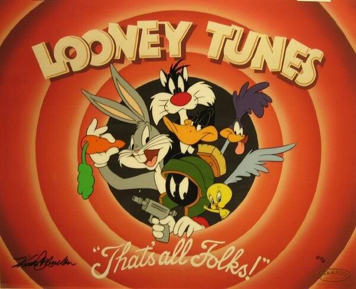

Hello!
This is a program I made to simulate a Pluto Rover to investigate Pluto's Surface.  Since you can't fix your code in space, TDD is a must.  I utilized the Open Source https://github.com/catchorg/Catch2 framework, which was a simple single-header file that made my life SO much easier (conclusion, sometimes Reddit provides better situational programming advice than Stack Overflow and all the sophisticated tech writers put together).  This code is written in C++ Programming language, and developed in Cloud 9 IDE.  
Most of the work of this program is done in the Pluto Rover class.  This class controls the Rover's position within the planet (planet is assumed to be perfectly round with a circumference of 100 arbitrary units), as well as obstacles that could impact the Rover's movement.
I only had two hours for this assignment (which I completed in 10 min, 45 min, 40 min, and 25 min increments), so some hacks were made.  One such hack was #include-ing the Pluto Rover's .cpp file instead of its .hpp file in the test script (pluto-rover-tests.cpp).  I did this because my test cases were failing in the test script, but not in the main function/simulation/sandbox (main.cpp), probably due to how the test framework was creating the main function (line 1 of pluto-rover-tests, #define CATCH_CONFIG_MAIN).  After consulting Google, I determined that including the .cpp instead of the .hpp was a quick (but not ideal) fix for the error I was receiving.  If I had more time, I would've investigated further solutions for reorganizing my test script, so it'd run with only #include-ing the .hpp file.
If I had more time, I also would clean up the Obstacle-handling code.  Ideally, I'd like to pull the Obstacle members out of the Rover class and into their own class.  This would probably involve having an overarching "Pluto" class that had members keeping track of both the Obstacle objects and the Pluto Rover object.  
Finally, I'd like to fully test my Obstacle-handling code with test cases for when the rover is facing south and west (currently I only test north and east).  I'd also like to have separate test cases for testing the 'L' and 'R' turning. Currently, the rotation cases are tested in with the forward/backward test cases.  I'd like for them to have their own section though, with the hope that it'd further streamline future debugging and validation efforts (I used to work in the aerospace field, I've heard horror stories about code coverage and over-testing efforts.  Hopefully this streamlined approach will help alleviate that).
Anyways, that's all folks!  Hope you like my code (and want to hire me :) )

